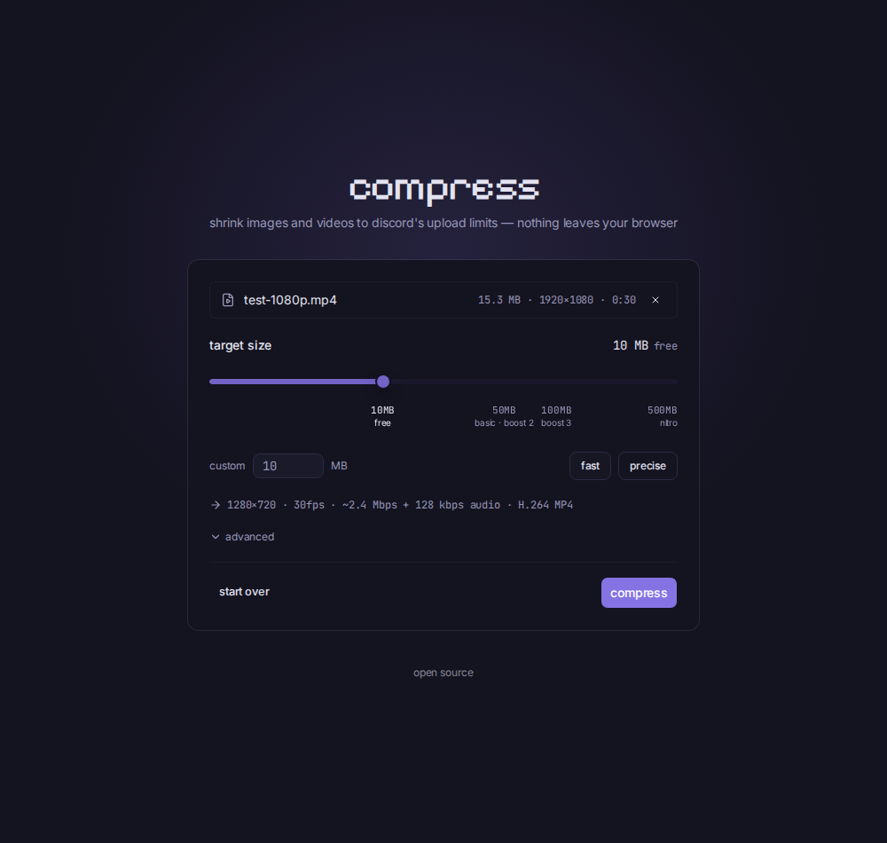

# compress

Shrink images and videos to Discord's upload limits — entirely in your browser. Files never leave your device.

Live at [compress.4x.rip](https://compress.4x.rip).



## How it works

Drop a file, pick a size (10 MB free tier by default, presets up to 500 MB Nitro), download the result. Videos come out as maximum-compatibility H.264 MP4s that embed and inline-play on Discord; images stay JPEG/PNG/WebP.

- **WebCodecs first** ([mediabunny](https://mediabunny.dev)) — hardware-accelerated, fast.
- **ffmpeg.wasm fallback** for browsers and formats WebCodecs can't handle (plus GIF→MP4 and two-pass "precise" mode) — loaded on demand.
- **Canvas** for images — the browser's own encoders with a quality binary search.

No server. Cloudflare serves static files; every byte of media stays on your machine.

## Development

```sh
bun install   # also stages the ffmpeg wasm cores into public/
bun run dev
bun test
```

## Deploy

```sh
bun run deploy   # vite build && wrangler deploy → compress.4x.rip
```

## Docs

`CLAUDE.md` has the project map; `docs/agents/` covers each area (ui, state, compression, deploy) in depth.
